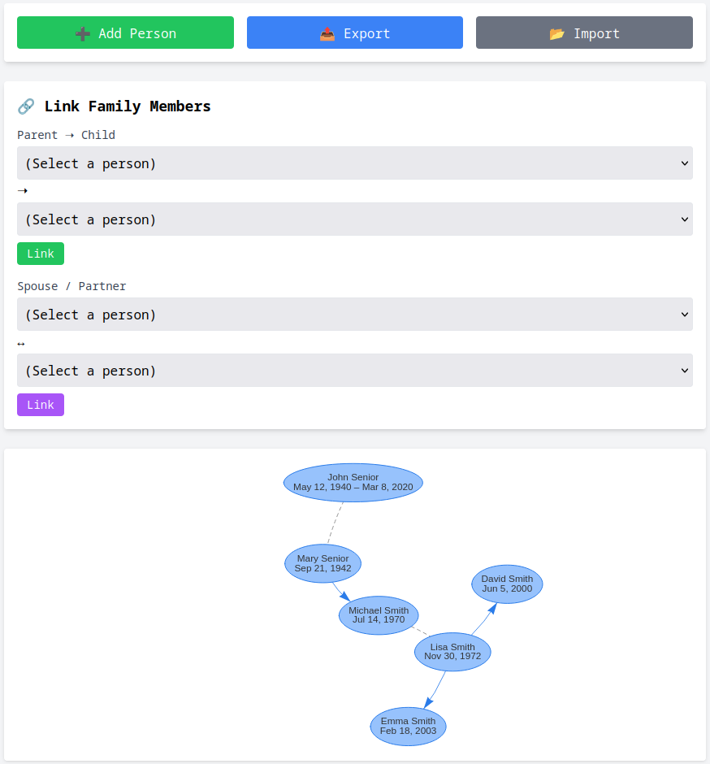

# 🌳 Family Tree – A Simple, Offline-Capable PWA

A lightweight, private, and easy-to-use **Progressive Web App (PWA)** to build and visualize your family tree — no installation, no server, no login required.

Just open in your browser, add family members, link relationships, and export your data anytime. Works offline and can be installed on any device like a real app!

🎯 **Perfect for preserving family history, sharing with relatives, or genealogy beginners.**

> Co-developed-by: Qwen Qwen3-235B-A22B-2507

---

## 🚀 Features

- ✅ Add, edit, and remove family members
- ✅ Link parent-child and spouse relationships
- ✅ Visualize your family tree interactively
- ✅ Export & import data (JSON) for backup
- 📱 Installable on mobile & desktop (PWA)
- 🔐 100% private — all data stored locally in your browser
- 🌐 No backend, no account, no tracking
- 💾 Works completely offline after first load

---

